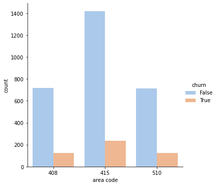

# SyriaTel-Churn-Prediction

Author;

EKENO K. ANTHONY

# Business Understanding
## Overview
The goal of this project is to build a predictive model that helps SyriaTel, a telecommunications company, to predict customer churn. By identifying customers who are likely to stop using the services soon, SyriaTel can take proactive measures to retain them and reduce customer attrition. This model will be valuable for improving customer retention, optimizing marketing campaigns, and reducing churn-related revenue losses.
### Problem Statement
SyriaTel is interested in identifying patterns that contribute to customer churn, so they can take action (e.g., offer special deals, improve customer service) to prevent customers from leaving.
#### Data Understanding
our data was sourced from google kaggle.it has 3333 rows and 21 columns
data had no missing values and duplicates
our dataset has three datatypes:float64,int64 and bool
#### Data analysis 

- Data was analysied by use of the following visualization for international plan, code area,customer service call against churn and nonchurn 

 # Modeling
The dataset was divided into training and testing
to train a model, enabling it to learn patterns, relationships, or functions from the data while testing is used to predict the unseen data.
we used the logistic model,random forest and decision trees.The modeling process involved optimizing performance through hyperparameter tuning to identify the best-performing model.

# Evaluation
- from the different model i used that is logistic regretion,decision tree  and random forest model i found that  the best model was  random forest model with roc score:86%

# conclusion
## Recommendations
- 1.Improve on customer services calls: This may include services such as wait time and customer satisfaction.
- 2.Introduce customised and affordable call plans for boh day and night calls
- 3.Proactive Customer Outreach: Regularly reach out to customers to gather feedback and address concerns
- 4.Security Measures: Implement stringent security measures ensure customer privacy and data protection
- 5.improve area code services: from analysis we can see area code 415 has high customer churn.
  

